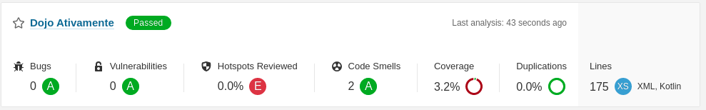

# Ativamente

## Microserviço

Esse microserviço faz parte de um ecossistema de e-commerce, e seu objetivo é controlar que o perfil do cliente que está fazendo a compra, não é um perfil de fraude, para isso algumas regras devem ser validadas antes de chamar o microserviço que realiza a confirmação da compra.

## Regras de Negócio - Contra Fraude

> Se atender todas as regras, o perfil é considerado como perfil de fraude, e deve ser retornada a mensagem "Fraude, compra negada!".

- Homens com 30 anos ou mais;
- Formação contábil;
- Limite disponível no cartão >= R$ 100.000;
- Verificar se o produto está na lista VISADOS PARA FRAUDE;
- Compras acima de R$ 5.000;

> Caso não atenda alguma regra, o perfil pode realizar a compra, e deve ser retornada a mensagem "Enviado para sistema de confirmação de compra".

## Exemplo de dados

```json
{
    "usuario": {
        "nome": "Pedrinho",
        "sexo": "Masculino",
        "formacao": "Contabil",
        "dataNascimento": "1976-05-23",
        "limiteCartao": 100000.50
    },
    "produtos": [
        {
            "nome": "Notebook",
            "valor": 20000.00
        }
    ]
}
```

## Casos de Teste

> Monte os casos de teste que ache válido antes de começar o código

## Saúde Sonar



## Comandos

Executar o build com testes
```script
mvn clean install
```

Executar o build sem testes
```script
mvn clean install -DskipTests
```

Executar apenas os testes
```script
mvn test
```

Executar o envio para o sonar
```script
mvn sonar:sonar
```
